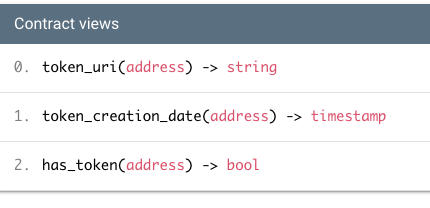

# SSI SBT

Self Sovereign Identity based Soulbound Tokens (SBTs).

SBTs are on-chain tokens holding personal information that can't be transfered (soulbound).
On Ethereum, they're implemented using ERC721 but restricting burns and tranfers.
On Tezos however, they're implemented using a custom smart contract exhibiting the same behavior as the Ethereum one.
This can be useful for on-chain dApps, in the gaming or DeFi worlds for instance, to permission access without going off-chain.

This app is meant to be used by Issuers of Verifiable Credentials to generate the related SBTs for users who need to get permissioned access to dApps.
The minted SBTs can be consumed by dApps that need to verify a user's credentials.

## Contract addresses

As a dApp (verifier), to verify if a user possesses a given token, you'll need to access the relevant Smart Contract.

### Altme DeFi Proof Of Compliance (DEFI)

This is the address for Altme's DeFi Proof Of Compliance (DEFI) token (https://issuer.talao.co/nft/defi)

| blockchain          | address                                                                                                                                    |
| ------------------- | ------------------------------------------------------------------------------------------------------------------------------------------ |
| ETH Testnet         | [`0x2285A09cABeb0D07005E86B71Af8e6C7e0497f29`](https://sepolia.etherscan.io/address/0x2285A09cABeb0D07005E86B71Af8e6C7e0497f29)            |
| ETH Mainnet         | [`0x240863E65b2ace78eda93334be396FF220f14354`](https://etherscan.io/tx/0xfe7b5347bddc77d15d5af2ac7fe7fb01faee217f9656072e2f5183f99c568fda) |
| BSC Testnet         | [`0x1589257BBfA909B1b3D17148a7a3D27A37ee92ba`](https://testnet.bscscan.com/address/0x1589257BBfA909B1b3D17148a7a3D27A37ee92ba)             |
| BSC Mainnet         | [`0x240863E65b2ace78eda93334be396FF220f14354`](https://bscscan.com/address/0x240863E65b2ace78eda93334be396FF220f14354)                     |
| Polygon PoS Testnet | [`0x240863e65b2ace78eda93334be396ff220f14354`](https://mumbai.polygonscan.com/address/0x240863e65b2ace78eda93334be396ff220f14354)          |
| Tezos Ghostnet      | [`KT1AcYTy6KGv8cpRUgfutFfg2HkphzGeub4t`](https://ghostnet.tzkt.io/KT1AcYTy6KGv8cpRUgfutFfg2HkphzGeub4t/operations/)                        |
| Tezos Mainnet       | [`KT1WDYsU9EHL1c4Zm2fd2YtqVMpFZ66TasqK`](https://tzkt.io/KT1WDYsU9EHL1c4Zm2fd2YtqVMpFZ66TasqK/operations/)                                 |

/!\ Those addresses may change, contracts are not updatable

## Soulbound Token API on EVM compatible blockchains

The solidity code for the Soulbound Token can be found in [`./sbt-contract-evm`](./sbt-contract-evm/contracts/SoulboundTokens.sol).

The contract ABI can be found in [`./sbt-contract-evm/abi.json`](./sbt-contract-evm/abi.json).

It's implementing the ERC721 interface from OpenZeppelin and will work like most ERC721.

The main differences are:

- transfers are blocked.
- we record the token's creation date so we can check if it has expired.

### Verify that a user does own a given token

```solidity
require(soulboundToken.balanceOf(address) > 0, "address doesn't have this token");
```

### Burn a token

A token owner can burn their own token via a Solidity call.

```solidity
soulboundToken.burn(token_id);
```

### Check expiry on-chain

As a verifier, you may check if a token is still valid by retrieving its timestamp:

```solidity
uint256 creation_date = soulboundToken.tokenTimestamp(token_id);

require(block.timestamp < (creation_date + 3600 * 24 * 60), "token has expired");
```

## Soulbound Token API on the Tezos blockchain

The JsLigo code for the Soulbound Token can be found in [`./sbt-contract-tz`](./sbt-contract-tz/contracts/SoulboundToken.jsligo).

An SBT contract is a map of `owner` as an `address` and an `ipfs_url` for the token's metadata.
Another map of `owner` and `timestamp` records the token's creation date.

The Smart Contract offers 3 views to:

1. Retrieve a `token_uri` given an owner's `address`
2. Retrieve the `token_creation_date` to verify that it hasn't expired
3. Verify if an owner has a token given a `KT1` address.



## Install

View the [Install](./INSTALL.md) guide if you want to run this service locally or deploy it to another environment.

## REST API

Only token issuers should need to use this API. Please check the [Postman Collection](./postman/test-collection.json) to exercise it. On-chain verifiers should use the Smart Contract's relevant methods.

This API works the exactly the same whether consuming an EVM blockchain or a Tezos blockchain. The `X-BLOCKCHAIN` header needs to be set to specify which blockchain to access.

Example request:

### Mint

Mint requires a `transfer_to` address and an `ipfs_url` url.
Also make sure to set the `X-API-KEY` for authentication, as well as a `X-BLOCKCHAIN` header to specify the blockchain to mint the token to.

```sh
curl --location --request POST 'localhost:3000/mint' \
--header 'Content-Type: application/x-www-form-urlencoded' \
--header 'X-API-KEY: testKey' \
--header 'X-BLOCKCHAIN: BINANCE'
--data-urlencode 'transfer_to=0x123address' \
--data-urlencode 'ipfs_url=ipfs://ipfs-url'
```

Response:

```
{
    "network": {
        "name": "bnbt",
        "chainId": 97
    },
    "contract_address": "0x1589257BBfA909B1b3D17148a7a3D27A37ee92ba",
    "tx_hash": "0xae12071058be915466e66f1044b889ac0508d580ebfda59773396aaf88c57b21"
}
```

### Burn

Burn requires an `address_for` address that represents the wallet public address that we want to burn the token for. Also make sure to set the `X-API-KEY` for authentication.

```sh
curl --location --request POST 'localhost:3000/burn' \
--header 'X-API-KEY: testKey' \
--header 'X-BLOCKCHAIN: BINANCE'
--header 'Content-Type: application/x-www-form-urlencoded' \
--data-urlencode 'address_for=0x123address'
```

Response:

```sh
{
    "network": {
        "name": "bnbt",
        "chainId": 97
    },
    "contract_address": "0x1589257BBfA909B1b3D17148a7a3D27A37ee92ba",
    "tx_hash": "0x698c9601f8647c09e300ca62f3c5d857189d9cf9e61de1881b550649a13f583f"
}
```

### Info

Info returns some useful information about the network being used (the blockchain that runs the smart contract) as well as the contract address and name of the token.
This endpoint lists all the available blockchains. The `networkName` value can be used to specify the `X-BLOCKCHAIN` header. When specified, it will mark the related network as `selected`. this could be useful to verify that the header works and maps to an linked blockchain.

```curl
curl --location --request GET 'localhost:3000/info'
```

Response

```sh
[
    {
        "networkName": "BINANCE",
        "selected": false,
        "info": {
            "network": {
                "name": "bnbt",
                "chainId": "97"
            },
            "contract_address": "0x1589257BBfA909B1b3D17148a7a3D27A37ee92ba",
            "name": "Proof of DeFi compliance",
            "symbol": "DEFI"
        }
    },
    {
        "networkName": "TEZOS",
        "selected": false,
        "info": {
            "network": {
                "name": "tezos",
                "chainId": "NetXnHfVqm9iesp"
            },
            "contract_address": "KT1JyVbngXYQy1FrbAJV4tQQaZwRmHj9o2jL",
            "symbol": "DEFI",
            "name": "Proof of DeFi compliance"
        }
    }
]
```

### Has

Checks if a wallet has a token. The wallet to test is set in the `url`:

```sh
curl --location --request GET 'localhost:3000/has/0xCdcc3Ae823F05935f0b9c35C1054e5C144401C0a' --header 'X-BLOCKCHAIN: BINANCE'
```

Response:

```
{
    "network": {
        "name": "bnbt",
        "chainId": 97
    },
    "contract_address": "0x1589257BBfA909B1b3D17148a7a3D27A37ee92ba",
    "has_token": true
}
```

### Token info

Retrieves the creation timestamp and token uri for a token. The token id is set in the url

```sh
curl --location --request GET 'localhost:3000/token/0xCdcc3Ae823F05935f0b9c35C1054e5C144401C0a' --header 'X-BLOCKCHAIN: BINANCE'
```

Response:

```
{
    "network": {
        "name": "bnbt",
        "chainId": 97
    },
    "contract_address": "0x1589257BBfA909B1b3D17148a7a3D27A37ee92ba",
    "token_uri": "ipfs://Qmf8Y4u1hYHaNYdhUUcvtKn3XM8JUk86zeqSjLvRkSoMsu",
    "token_creation_timestamp": 1684916584
}
```
